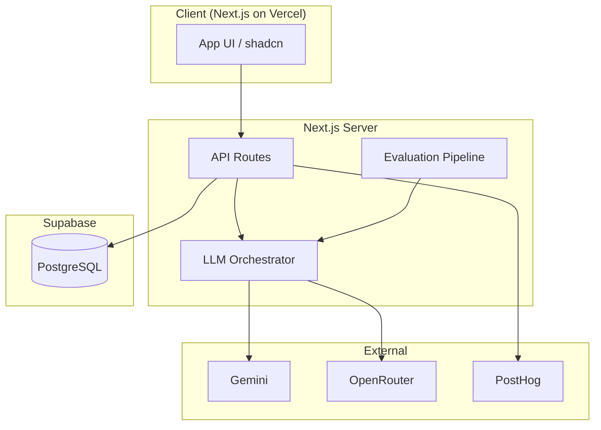
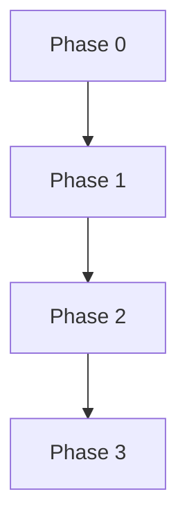

# Architecture overview

**Product:** [../problemsStatement.md](../problemsStatement.md)  
**Implemented phases:** [../phases/implemented/](../phases/implemented/)  
**Full roadmap:** [../phaseWiseArchitecture.md](../phaseWiseArchitecture.md)

---

## Architecture principles

| Principle | Implication |
|-----------|-------------|
| **Phase isolation** | Ship usable value per phase; avoid building Phase 5 tables in Phase 1. |
| **LLM behind an API** | All Gemini/OpenRouter calls go through server-side modules (never expose keys in the browser). |
| **Event-first analytics** | PostHog events defined in Phase 0; later phases only add event names. |
| **Supabase as system of record** | Auth, profiles, sessions, scores, and recommendations live in PostgreSQL via Supabase. |
| **Progressive enhancement** | Text interviews first; voice layers on without rewriting the interview engine. |
| **Failover by design** | OpenRouter backs up Gemini when primary LLM fails or rate-limits. |

---

## Target system (end state)



---

## Phase map

| Phase | Name | Status | Guide |
|-------|------|--------|-------|
| 0 | Foundation | ✅ | [phase-0-foundation](../phases/implemented/phase-0-foundation/) |
| 1 | Text MVP | ✅ | [phase-1-text-interviews](../phases/implemented/phase-1-text-interviews/) |
| 2 | Evaluation | ✅ | [phase-2-evaluation](../phases/implemented/phase-2-evaluation/) |
| 3 | Readiness dashboard | ✅ | [phase-3-readiness-dashboard](../phases/implemented/phase-3-readiness-dashboard/) |
| 4 | Voice & adaptive | ✅ | [phase-4-voice-adaptive](../phases/implemented/phase-4-voice-adaptive/) |
| 5 | Personalization | ✅ | [phase-5-personalization](../phases/implemented/phase-5-personalization/) |
| 6 | Data enrichment | ✅ | [phase-6-data-enrichment](../phases/implemented/phase-6-data-enrichment/) |
| 7 | Partners & scale | ✅ | [phase-7-partners](../phases/implemented/phase-7-partners/) |
| 8+ | Vision (MVP) | ✅ | [phase-8-vision](../phases/implemented/phase-8-vision/) |

---

## Phase dependency graph



**Critical path to MVP:** 0 → 1 → 2 → 3 (interviews with scores and dashboard).

---

## Application code layout

```text
app/                 # Pages + API routes
components/          # UI (auth, interview, dashboard)
lib/
  supabase/
  llm/
  interview/         # Phase 1+
  evaluation/        # Phase 2+
prompts/v1/
db/migrations/
docs/phases/implemented/   # Phase docs (this repo)
```
