# Phase-Wise Architecture — AI Interview Readiness Platform (nextRound)

Architecture plan derived from [problemsStatement.md](./problemsStatement.md). Each phase adds capability without blocking the next; later phases assume earlier foundations are stable.

> **Navigation:** [docs/README.md](./README.md) · **Implemented:** [phases/implemented/](./phases/implemented/) · **Planned:** [phases/planned/](./phases/planned/)

---

## Table of Contents

1. [Architecture Principles](#architecture-principles)
2. [Target System (End State)](#target-system-end-state)
3. [Phase Overview](#phase-overview)
4. [Phase 0 — Foundation](#phase-0--foundation)
5. [Phase 1 — Text Mock Interviews (MVP)](#phase-1--text-mock-interviews-mvp)
6. [Phase 2 — Evaluation & Feedback Loop](#phase-2--evaluation--feedback-loop)
7. [Phase 3 — Readiness Dashboard](#phase-3--readiness-dashboard)
8. [Phase 4 — Voice & Adaptive Interviews](#phase-4--voice--adaptive-interviews)
9. [Phase 5 — Personalization Engine](#phase-5--personalization-engine)
10. [Phase 6 — Data Enrichment & Role Depth](#phase-6--data-enrichment--role-depth)
11. [Phase 7 — Partners & Scale](#phase-7--partners--scale)
12. [Phase 8+ — Long-Term Vision](#phase-8--long-term-vision)
13. [Cross-Phase Concerns](#cross-phase-concerns)
14. [Data Model Evolution](#data-model-evolution)

---

## Architecture Principles

| Principle | Implication |
|-----------|-------------|
| **Phase isolation** | Ship usable value per phase; avoid building Phase 5 tables in Phase 1. |
| **LLM behind an API** | All Gemini/OpenRouter calls go through a server-side service layer (never expose keys in the browser). |
| **Event-first analytics** | PostHog events defined in Phase 0; feature phases only add event names. |
| **Supabase as system of record** | Auth, profiles, sessions, scores, and recommendations live in PostgreSQL via Supabase. |
| **Progressive enhancement** | Text interviews first; voice layers on without rewriting the interview engine. |
| **Failover by design** | OpenRouter is a backup path when primary LLM fails or rate-limits. |

---

## Target System (End State)

High-level view after Phases 0–7 (vision items in Phase 8+).

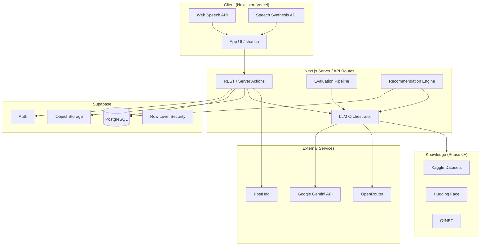

### Logical layers

| Layer | Responsibility |
|-------|----------------|
| **Presentation** | Interview UI, dashboard, onboarding, settings |
| **Application** | Session lifecycle, scoring orchestration, practice plans |
| **AI** | Prompt templates, structured JSON output, model routing |
| **Data** | Users, interviews, turns, evaluations, aggregates |
| **Observability** | PostHog product analytics, error logging |

---

## Phase Overview

| Phase | Name | Primary outcome | Maps to product brief |
|-------|------|-----------------|------------------------|
| **0** | Foundation | Deployable app, auth, schema skeleton | Tech stack, analytics |
| **1** | Text MVP | End-to-end text mock interview | Mock interview engine (basic) |
| **2** | Evaluation | Structured scores + feedback per answer | AI response evaluation |
| **3** | Dashboard | Trends, strengths/weaknesses | Readiness dashboard |
| **4** | Voice & adaptive | STT/TTS, follow-ups, difficulty | Mock engine (full) |
| **5** | Personalization | Practice tasks, pathways | Improvement engine |
| **6** | Data enrichment | Role/competency-aware questions | Dataset sources, O*NET |
| **7** | Partners | Cohorts, placement cells, coaches | Secondary users |
| **8+** | Vision | Video, peer mocks, career coach | Long-term vision |

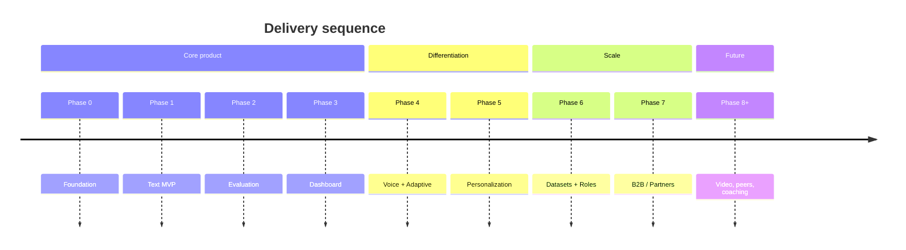

---

## Phase 0 — Foundation

**Goal:** Runnable monorepo-style Next.js app on Vercel with Supabase auth and empty domain schema.

### Scope

- Next.js App Router, Tailwind, shadcn/ui shell (landing, auth, empty dashboard shell)
- Supabase project: Auth (email/OAuth), `profiles`, environment config
- API route skeleton + shared LLM client module (no business prompts yet)
- PostHog bootstrap (identify user, page views, `interview_started` placeholder)
- CI: lint, typecheck, preview deploy on Vercel

### Architecture

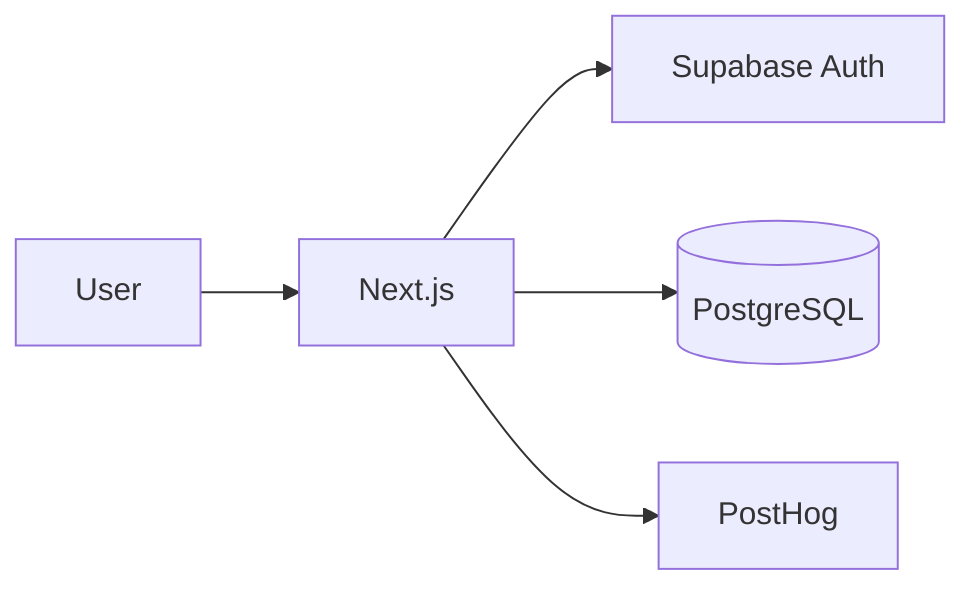

### Key components

| Component | Path / module (suggested) |
|-----------|---------------------------|
| `lib/supabase/client.ts` | Browser client |
| `lib/supabase/server.ts` | Server client + cookies |
| `lib/llm/client.ts` | Gemini + OpenRouter factory |
| `middleware.ts` | Protected routes |
| `db/migrations/` | Initial tables |

### Database (initial)

- `profiles` — `id`, `user_id`, `display_name`, `target_role`, `created_at`
- `interview_sessions` — `id`, `user_id`, `status`, `mode`, `created_at` (unused until Phase 1)

### Exit criteria

- User can sign up, sign in, land on protected dashboard
- Health check API returns OK; LLM ping returns a test completion (server-only)

---

## Phase 1 — Text Mock Interviews (MVP)

**Goal:** User completes a **text-only** mock interview: questions generated, answers stored, session completed.

Maps to: **AI Mock Interview Engine** (minimal — single mode, linear flow).

### Scope

- Interview modes enum: `behavioral` first; HR/PM/technical stubbed in UI
- Question generation via Gemini (role + difficulty from profile)
- Turn-based UI: question → text answer → next question (fixed count, e.g. 5)
- Persist `interview_turns` (question, answer, timestamp)
- Session states: `draft` → `in_progress` → `completed`
- No scoring yet (Phase 2); show “processing” placeholder or raw transcript

### Architecture

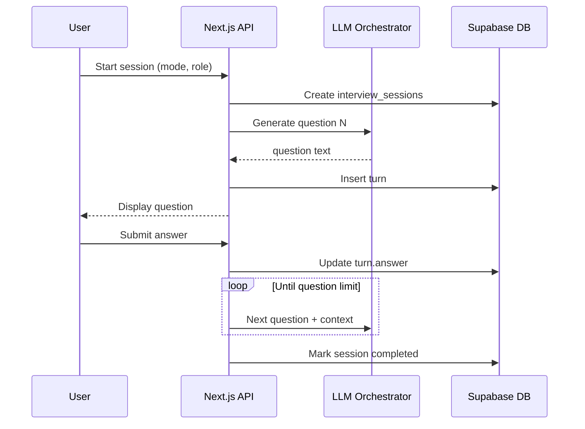

### LLM contracts

- **Input:** `role`, `mode`, `previous_turns[]`, `question_index`
- **Output (structured JSON):** `{ "question": string, "rationale": string }`

### API surface

| Endpoint / action | Purpose |
|-------------------|---------|
| `POST /api/interviews` | Create session |
| `POST /api/interviews/:id/turns` | Submit answer, get next question |
| `GET /api/interviews/:id` | Session + turns |

### Exit criteria

- Complete 5-question behavioral interview without errors
- Session replayable from history list

---

## Phase 2 — Evaluation & Feedback Loop

**Goal:** Every answer receives **structured evaluation** aligned with the product rubric.

Maps to: **AI Response Evaluation**.

### Scope

- Post-turn (or post-session) evaluation pipeline
- Dimensions: communication clarity, structure (STAR), content relevance, filler words (text heuristic), logical flow
- Aggregate **session score** + per-turn breakdown
- Feedback UI: scores, bullet strengths, bullet improvements
- OpenRouter fallback if Gemini evaluation fails

### Architecture

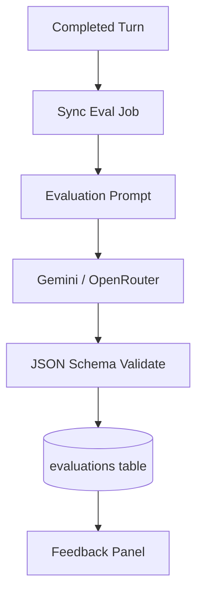

### LLM output schema (example)

```json
{
  "scores": {
    "communication": 0,
    "structure": 0,
    "content": 0,
    "overall": 0
  },
  "star_detected": false,
  "filler_word_count": 0,
  "strengths": ["..."],
  "improvements": ["..."]
}
```

### Database additions

- `evaluations` — `turn_id`, `session_id`, `scores` (jsonb), `feedback` (jsonb), `model`, `created_at`

### Exit criteria

- Each completed session shows per-answer and session-level scores
- Evaluation reproducible with stored prompts + model version

---

## Phase 3 — Readiness Dashboard

**Goal:** User sees **measurable progress** over time.

Maps to: **Readiness Dashboard**.

### Scope

- Aggregate queries: avg scores, trend lines, session count
- Strengths/weaknesses rollup (top 3 recurring themes from evaluations)
- Historical session comparison
- Dashboard charts (communication, consistency, readiness index)

### Architecture

```mermaid
flowchart LR
  subgraph Write path
    Eval[evaluations] --> AggJob[/materialized or nightly view]
  end
  subgraph Read path
    AggJob --> Metrics[user_readiness_metrics view]
    Metrics --> Dash[Dashboard API]
    Dash --> UI[Readiness Dashboard]
  end
```

### Metrics (computed)

| Metric | Definition |
|--------|------------|
| Communication score | Rolling avg of communication dimension |
| Consistency | Std dev of session overall scores (lower = more consistent) |
| Readiness index | Weighted composite (configurable) |
| Weak themes | NLP cluster or LLM-tagged recurring `improvements` |

### Database additions

- `user_readiness_snapshots` — daily rollup per user (optional materialized view)
- Indexes on `(user_id, created_at)` for sessions and evaluations

### Analytics (PostHog)

- `dashboard_viewed`, `session_reviewed`, `readiness_index_band`

### Exit criteria

- User with 3+ sessions sees trend chart and documented strengths/weaknesses

---

## Phase 4 — Voice & Adaptive Interviews

**Goal:** **Realistic** interviews: voice in/out, dynamic follow-ups, adaptive difficulty.

Maps to: **AI Mock Interview Engine** (full) + voice stack from product brief.

### Scope

- Web Speech API: STT for answers, TTS for interviewer prompts
- Transcript stored alongside `answer_text`; filler detection from transcript
- **Adaptive follow-ups:** LLM receives full thread + weak dimensions → probes deeper
- **Difficulty:** adjust question complexity from last N session scores
- Multiple modes enabled: HR, PM, technical, behavioral
- Optional: Supabase Storage for audio blobs (if recording enabled later)

### Architecture

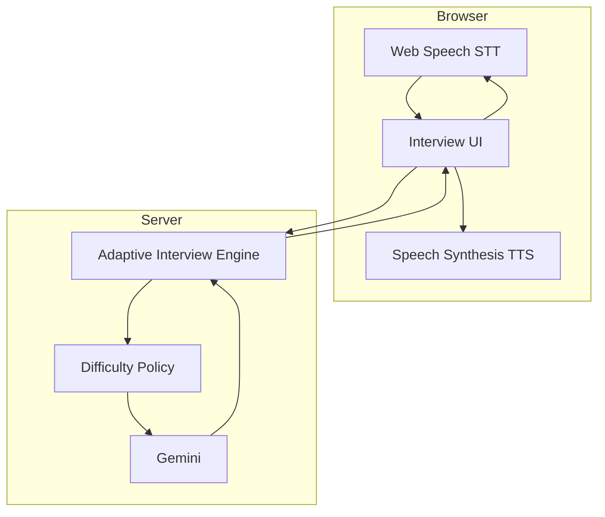

### Adaptive engine rules

| Signal | Action |
|--------|--------|
| Low structure score on last turn | Follow-up: “Walk me through situation, task, action, result.” |
| High overall scores | Harder scenario or time-pressure prompt |
| Vague answer | Clarifying follow-up before next topic |

### API changes

- `POST /api/interviews/:id/turns` accepts `{ text?, transcript?, audio_url? }`
- New `interview_config`: `adaptive: true`, `max_followups_per_topic`

### Exit criteria

- Voice-only interview completable in Chrome/Edge
- At least one adaptive follow-up triggered from prior weak evaluation

---

## Phase 5 — Personalization Engine

**Goal:** **Actionable** next steps—not generic tips.

Maps to: **Personalized Improvement Engine**.

### Scope

- After session: generate practice plan (tasks, retries, role pathway step)
- Task types: “retry question X”, “STAR drill”, “60s elevator on topic Y”
- User task inbox + completion tracking
- Retry links open pre-filled mini-session (1–2 questions)

### Architecture

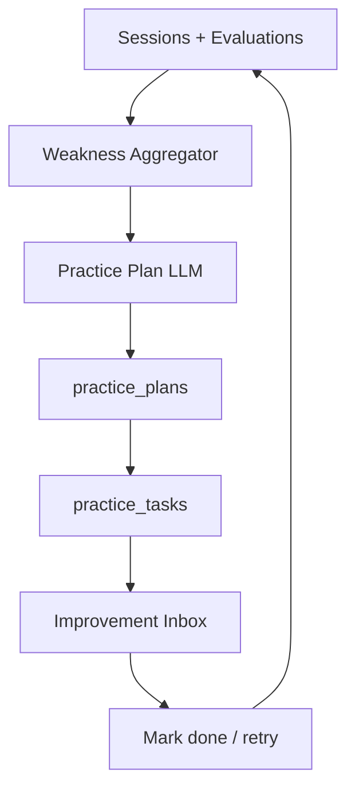

### Database additions

- `practice_plans` — `user_id`, `session_id`, `summary`, `created_at`
- `practice_tasks` — `plan_id`, `type`, `payload`, `status`, `due_at`

### LLM output (practice plan)

```json
{
  "pathway_step": "behavioral_week_2",
  "tasks": [
    { "type": "retry", "session_id": "...", "turn_id": "..." },
    { "type": "exercise", "title": "...", "instructions": "..." }
  ]
}
```

### Exit criteria

- Completing an interview auto-creates ≥2 tasks; user can mark complete and see pathway progress

---

## Phase 6 — Data Enrichment & Role Depth

**Goal:** Questions and rubrics grounded in **external datasets** and occupational frameworks.

Maps to: **Data & Research Sources** (Kaggle, Hugging Face, O*NET, Scholar-informed rubrics).

### Scope

- Curated question bank tables seeded from Kaggle imports
- O*NET competency tags → `role_templates` (skills, sample questions)
- Optional resume upload → skill extraction (Hugging Face–style pipeline or LLM)
- Role-specific rubric weights (PM vs SWE vs HR)
- Offline ETL scripts (not in hot path); runtime reads from DB

### Architecture

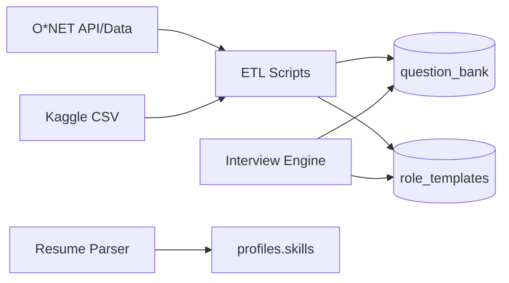

### Database additions

- `question_bank` — `role`, `mode`, `difficulty`, `text`, `tags[]`
- `role_templates` — `role_key`, `competencies`, `rubric_weights` (jsonb)
- `profiles.resume_url`, `profiles.skills` (jsonb)

### Exit criteria

- PM interview pulls from tagged bank + O*NET competencies; resume optional enriches first question

---

## Phase 7 — Partners & Scale

**Goal:** Support **secondary users**—placement cells, bootcamps, coaches.

Maps to: **Secondary users** + production hardening.

### Scope

- Organizations / cohorts: admin invites students, views aggregate readiness (no PII leakage)
- Coach read-only view of assigned mentees
- Rate limiting, LLM cost caps per org
- Supabase RLS policies per `org_id`
- Export reports (CSV) for placement cells
- Bootcamp branding (white-label subdomain optional)

### Architecture

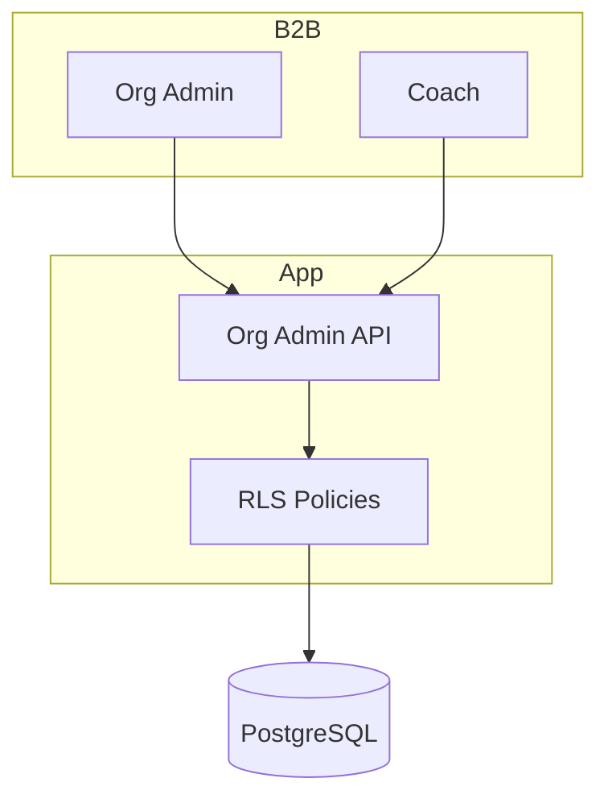

### Database additions

- `organizations`, `org_members`, `cohorts`, `cohort_members`
- `org_analytics_snapshots` — anonymized aggregates

### Exit criteria

- Admin creates cohort, invites 10 users, sees cohort avg readiness without viewing raw answers

---

## Phase 8+ — Long-Term Vision

Items from product brief **Long-Term Vision**—each is a sub-initiative after Phase 7.

| Initiative | Architecture notes |
|------------|-------------------|
| **AI video interview** | WebRTC or uploaded video → Supabase Storage → async worker (Edge Function / queue) → vision LLM |
| **Emotion / confidence detection** | Audio/video features pipeline; separate `media_analysis` table; privacy consent required |
| **Recruiter benchmarking** | Anonymous percentile vs cohort; requires large N and governance |
| **Company-specific simulations** | `company_profiles` + custom question packs; legal review for trademarks |
| **Resume-aware interviews** | Extend Phase 6 parser + inject resume context in every prompt |
| **Peer mock interviews** | Real-time room (Livekit/Daily) or async peer review; new `peer_sessions` domain |
| **AI career coaching** | Long-horizon agent with memory; separate service from interview engine |

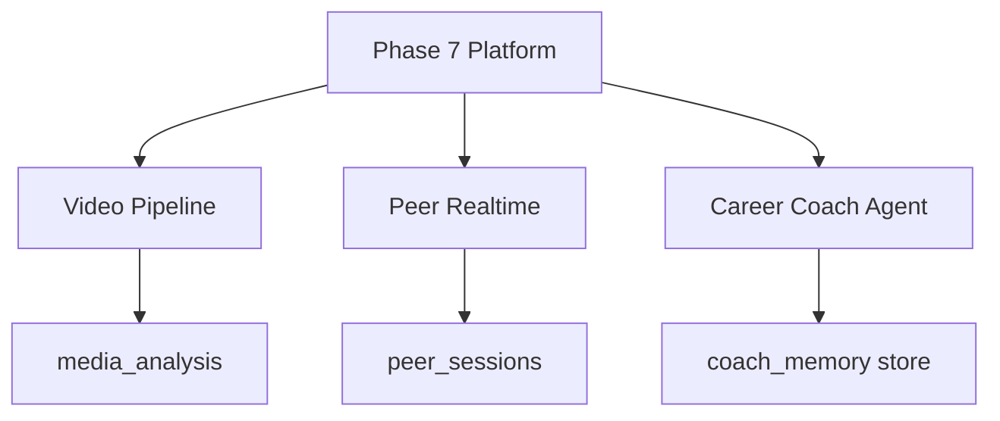

---

## Cross-Phase Concerns

### Security

| Concern | Approach |
|---------|----------|
| API keys | Server-only env vars; never `NEXT_PUBLIC_` for LLM |
| User data | Supabase RLS on all user-owned tables |
| Audio/video (Phase 4+) | Explicit consent; retention policy |
| B2B (Phase 7) | Role-based access: `admin`, `coach`, `member` |

### LLM orchestration (all phases)

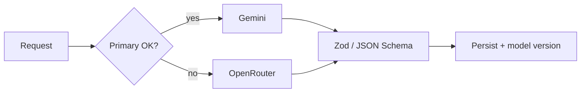

- Version prompts in repo (`prompts/v1/...`)
- Log `model`, `latency_ms`, `token_estimate` per call

### Observability

| Phase | PostHog events (examples) |
|-------|---------------------------|
| 0 | `signup`, `login` |
| 1 | `interview_started`, `interview_completed` |
| 2 | `evaluation_received` |
| 3 | `dashboard_viewed` |
| 4 | `voice_interview_started`, `adaptive_followup` |
| 5 | `practice_task_completed` |
| 7 | `cohort_invite_sent` |

### Deployment

| Environment | Frontend | Backend |
|-------------|----------|---------|
| Dev | Local Next.js | Supabase local or dev project |
| Staging | Vercel preview | Supabase staging |
| Prod | Vercel production | Supabase prod + RLS audited |

---

## Data Model Evolution

Core entities and when they appear:

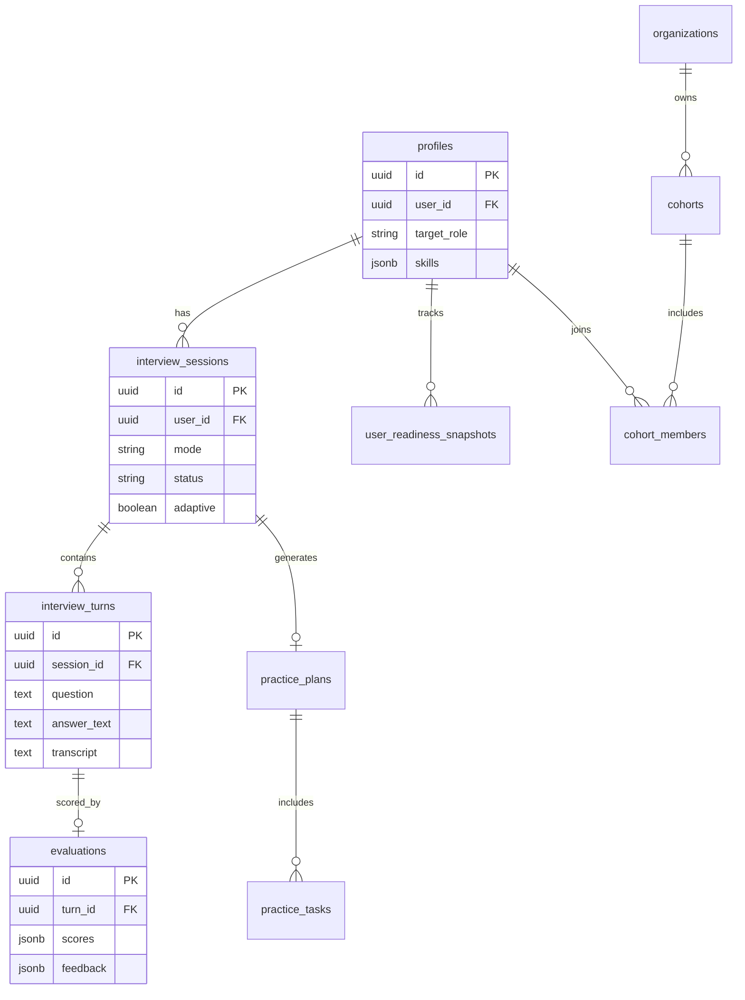

| Phase | Tables / views added |
|-------|----------------------|
| 0 | `profiles`, `interview_sessions` (skeleton) |
| 1 | `interview_turns`, session fields active |
| 2 | `evaluations` |
| 3 | `user_readiness_snapshots` or views |
| 5 | `practice_plans`, `practice_tasks` |
| 6 | `question_bank`, `role_templates` |
| 7 | `organizations`, `cohorts`, `org_members` |
| 8+ | `media_analysis`, `peer_sessions`, etc. |

---

## Suggested Folder Structure (by phase accumulation)

```
nextRound/
├── app/                    # Next.js routes (UI + API)
│   ├── (auth)/
│   ├── dashboard/
│   └── api/interviews/
├── components/             # shadcn + feature components
├── lib/
│   ├── supabase/
│   ├── llm/               # client, router, prompts
│   ├── interview/        # engine, adaptive policy (Phase 4)
│   ├── evaluation/       # Phase 2
│   ├── readiness/        # Phase 3
│   └── personalization/  # Phase 5
├── prompts/                # versioned prompt templates
├── db/migrations/          # Supabase SQL
├── scripts/etl/            # Phase 6 dataset imports
└── docs/
    ├── README.md
    ├── problemsStatement.md
    ├── phaseWiseArchitecture.md
    └── phases/
        ├── implemented/   # phase-0 … phase-5 guides
        └── planned/
```

---

## Phase Dependency Graph

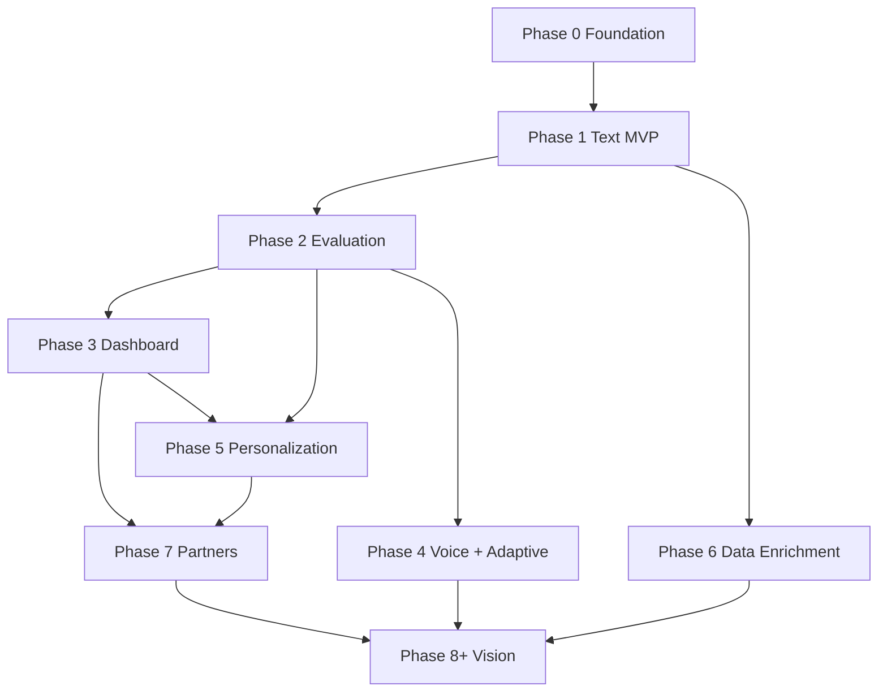

**Critical path to MVP:** Phase 0 → 1 → 2 → 3 (text interviews with scores and dashboard).

**Differentiation path:** Phase 4 → 5 (voice, adaptive, personalized coaching loop).

---

*Related: [problemsStatement.md](./problemsStatement.md) · [phases/implemented/](./phases/implemented/)*
