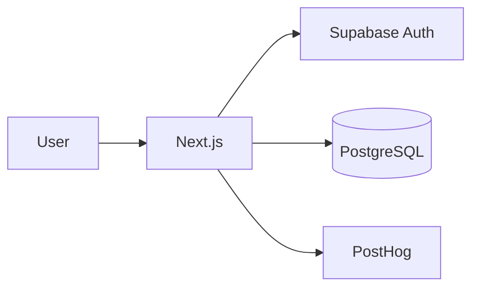

# Phase 0 — Foundation

| | |
|--|--|
| **Status** | ✅ Implemented |
| **Migration** | `db/migrations/001_initial.sql` |
| **Full roadmap** | [Phase 0 in phaseWiseArchitecture](../../../phaseWiseArchitecture.md#phase-0--foundation) |

## Goal

Runnable Next.js app on Vercel with Supabase auth and empty domain schema.

## Architecture



### Scope

- Next.js App Router, Tailwind, shadcn/ui (landing, auth, dashboard shell)
- Supabase Auth (email + Google OAuth)
- Tables: `profiles`, `interview_sessions` (skeleton)
- Server-side LLM client (Gemini + OpenRouter) — no interview prompts yet
- PostHog bootstrap
- CI: lint, typecheck, build

### Database

- `profiles` — `user_id`, `display_name`, `target_role`
- `interview_sessions` — `status`, `mode` (used in Phase 1)
- RLS policies, auto-create profile on signup

## Implementation

### Routes & APIs

| Path | Purpose |
|------|---------|
| `/` | Landing |
| `/login`, `/signup` | Auth |
| `/dashboard` | Protected shell |
| `GET /api/health` | Health check |
| `GET /api/llm/ping` | LLM connectivity (auth required) |

### Key files

```text
app/page.tsx
app/login/, app/signup/, app/dashboard/
app/api/health/, app/api/llm/ping/
app/auth/callback/, app/auth/actions.ts
lib/supabase/, lib/llm/client.ts, lib/env.ts
middleware.ts
components/providers/posthog-provider.tsx
.github/workflows/ci.yml
```

## Exit criteria

- [ ] Migration `001` applied in Supabase
- [ ] `.env.local` configured (`NEXT_PUBLIC_SUPABASE_*`, optional LLM/PostHog)
- [ ] Sign up / log in → `/dashboard`
- [ ] `GET /api/health` → `{ ok: true }`
- [ ] LLM ping works with `GEMINI_API_KEY` and/or `OPENROUTER_API_KEY`

## Next

[Phase 1 — Text mock interviews](../phase-1-text-interviews/)
