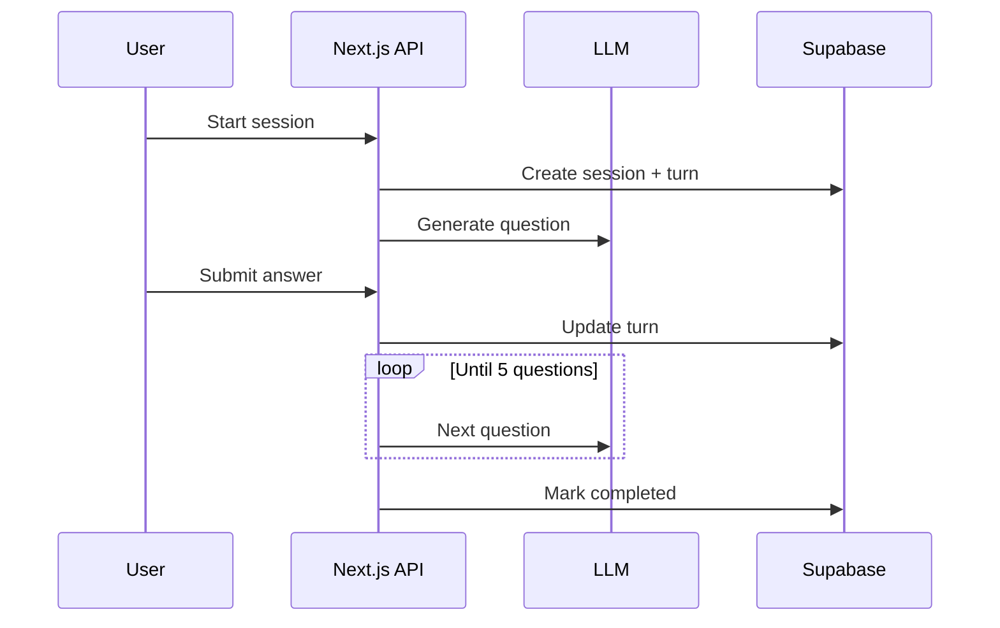

# Phase 1 — Text mock interviews (MVP)

| | |
|--|--|
| **Status** | ✅ Implemented |
| **Migration** | `db/migrations/002_interview_turns.sql` |
| **Depends on** | [Phase 0](../phase-0-foundation/) |
| **Full roadmap** | [Phase 1 in full-roadmap](../../../phaseWiseArchitecture.md#phase-1--text-mock-interviews-mvp) |

## Goal

User completes a **text-only** mock interview: questions generated, answers stored, session completed.

## Architecture



### Scope

- **Behavioral** mode live; HR / PM / technical shown as “Soon” in UI
- 5 turn-based questions (config: `QUESTIONS_PER_SESSION`)
- `interview_turns` table
- Session flow: `in_progress` → `completed`
- No scoring yet (Phase 2)

### API

| Method | Route | Purpose |
|--------|-------|---------|
| `POST` | `/api/interviews` | Create session + first question |
| `POST` | `/api/interviews/:id/turns` | Submit answer; next question or complete |
| `GET` | `/api/interviews/:id` | Session + turns |
| `GET` | `/api/interviews` | List sessions (history) |

### LLM contract

- **Prompt:** `prompts/v1/generate-question.ts`
- **Output (JSON):** `{ "question": string, "rationale": string }`

### Database (Phase 1)

- `interview_turns` — `question`, `answer_text`, `turn_index`, `rationale`
- `interview_sessions.target_role` — role snapshot for prompts

## Implementation

### UI routes

| Path | Purpose |
|------|---------|
| `/interviews/new` | Start interview (mode + target role) |
| `/interviews/[id]` | Active interview room |

### Key files

```text
app/interviews/new/page.tsx
app/interviews/[id]/page.tsx
app/api/interviews/route.ts
app/api/interviews/[id]/route.ts
app/api/interviews/[id]/turns/route.ts
lib/interview/generate-question.ts
lib/interview/session-access.ts
lib/interview/constants.ts
prompts/v1/generate-question.ts
components/interview/start-interview-form.tsx
components/interview/interview-room.tsx
components/interview/session-history.tsx
```

### Analytics

- `interview_started` — first question of a session
- `interview_completed` — session finished

## Exit criteria

- [ ] Migration `002` applied
- [ ] LLM keys configured
- [ ] Complete 5-question behavioral interview without errors
- [ ] Session replayable from dashboard (View / Continue)

## Next

[Phase 2 — Evaluation & feedback](../phase-2-evaluation/)
