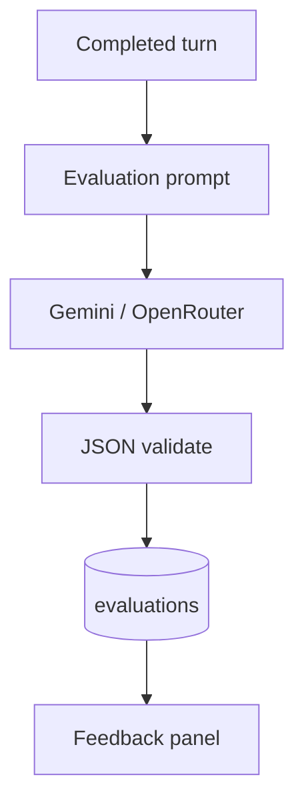

# Phase 2 — Evaluation & feedback loop

| | |
|--|--|
| **Status** | ✅ Implemented |
| **Migration** | `db/migrations/003_evaluations.sql` |
| **Depends on** | [Phase 1](../phase-1-text-interviews/) |
| **Full roadmap** | [Phase 2 in full-roadmap](../../../phaseWiseArchitecture.md#phase-2--evaluation--feedback-loop) |

## Goal

Every answer receives **structured evaluation**; completed sessions show per-answer and **session-level** scores.

## Architecture



### Scope

- Sync evaluation when the **last answer** is submitted (all turns)
- Scores 0–100: communication, structure, content, logical flow, overall
- STAR detection, filler-word **text heuristic**, strengths & improvements
- Session aggregate stored on `interview_sessions.session_scores`
- Gemini primary, OpenRouter fallback

### API

| Method | Route | Purpose |
|--------|-------|---------|
| `POST` | `/api/interviews/:id/turns` | On final submit → run evaluations |
| `GET` | `/api/interviews/:id` | Session + turns + evaluations (lazy backfill) |
| `POST` | `/api/interviews/:id/evaluate` | Retry / backfill evaluation |

### LLM contract

- **Prompt:** `prompts/v1/evaluate-answer.ts`
- **Version stored:** `v1` (`lib/evaluation/constants.ts`)
- **Example output:**

```json
{
  "scores": {
    "communication": 0,
    "structure": 0,
    "content": 0,
    "logical_flow": 0,
    "overall": 0
  },
  "star_detected": false,
  "strengths": ["..."],
  "improvements": ["..."]
}
```

Filler count is computed in code (`lib/evaluation/filler-words.ts`) and stored in `feedback.filler_word_count`.

### Database (Phase 2)

| Table / column | Purpose |
|----------------|---------|
| `evaluations` | Per-turn `scores`, `feedback`, `model`, `provider`, `prompt_version` |
| `interview_sessions.session_scores` | Session averages |

## Implementation

### UI

- Completed interview: `EvaluationPanel`, `TurnFeedbackCard`, `ScoreGrid`
- Dashboard history: overall score badge on completed sessions

### Key files

```text
db/migrations/003_evaluations.sql
lib/evaluation/evaluate-turn.ts
lib/evaluation/run-session-evaluations.ts
lib/evaluation/session-summary.ts
lib/evaluation/filler-words.ts
lib/evaluation/access.ts
lib/interview/session-detail.ts
prompts/v1/evaluate-answer.ts
app/api/interviews/[id]/evaluate/route.ts
components/interview/evaluation-panel.tsx
components/interview/turn-feedback-card.tsx
components/interview/completed-interview.tsx
components/interview/score-display.tsx
components/interview/evaluation-tracker.tsx
```

### Analytics

- `evaluation_received` — when feedback is shown (with `sessionId`, `turnCount`)

## Exit criteria

- [ ] Migration `003` applied
- [ ] Complete interview → session scores + per-answer feedback visible
- [ ] Dashboard shows **Overall** score for completed sessions
- [ ] `evaluations` rows include `prompt_version` and `model`

## Next

[Phase 3 — Readiness dashboard](../phase-3-readiness-dashboard/)
